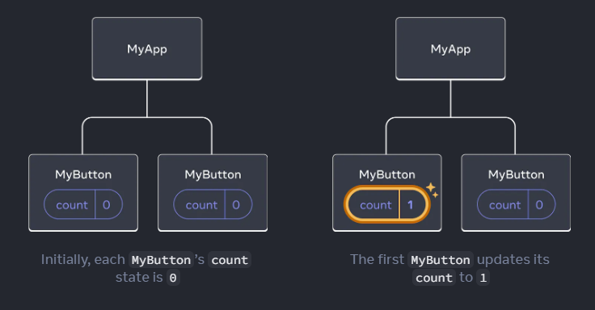
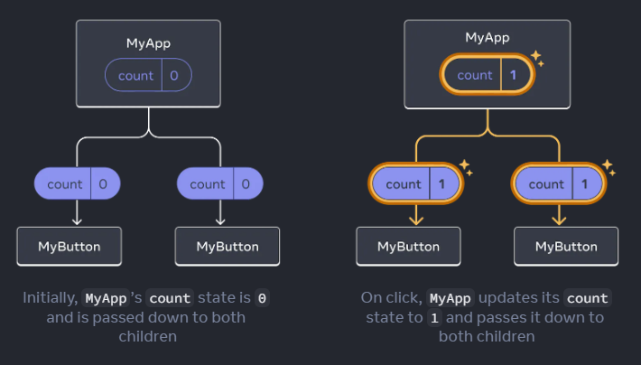

## Quick Start 
(https://react.dev/learn)

리액트 문서에 오신 것을 환영합니다! 이 페이지에서는 일상적으로 사용할 리액트 개념의 80%에 대한 소개를 제공합니다.


### 컴포넌트 생성과 중첩

React 앱은 컴포넌트들로 구성됩니다. 컴포넌트는 자체적인 로직과 외형을 가진 UI (사용자 인터페이스)의 한 부분입니다. 컴포넌트는 버튼과 같이 작을 수도 있고, 전체 페이지와 같이 큰 범위일 수도 있습니다.

React 컴포넌트는 마크업을 반환하는 JavaScript 함수입니다.

```
function MyButton() {
  return (
    <button>I'm a button</button>
  );
}
```

이제 `MyButton`을 선언했으므로 다른 컴포넌트에 중첩할 수 있습니다.

```
export default function MyApp() {
  return (
    <div>
      <h1>Welcome to my app</h1>
      <MyButton />
    </div>
  );
}
```

`<MyButton />`은 첫 글자가 대문자로 시작하므로 React 컴포넌트라는 것을 알 수 있습니다. 반면에 `<div>`나 `<span>`과 같은 HTML 태그는 소문자로 작성됩니다.

`export default` 키워드는 파일에서 주요 컴포넌트를 지정합니다. JavaScript 구문에 익숙하지 않은 경우, MDN과 javascript.info에 좋은 참고 자료가 있습니다.

### JSX를 사용한 마크업 작성

위에서 보았던 마크업 구문을 JSX라고 합니다. 이는 선택적이지만, 대부분의 React 프로젝트에서는 편의성을 위해 JSX를 사용합니다. [로컬 개발에 권장하는 모든 도구](https://react.dev/learn/installation)들은 JSX를 기본적으로 지원합니다.

JSX는 HTML보다 엄격합니다. `<br />`와 같이 태그를 닫아야 합니다. 컴포넌트는 또한 여러 개의 JSX 태그를 반환할 수 없습니다. 대신, `<div>...</div>`나 빈 `<>...</>` 래퍼로 감싸야 합니다:

```
function AboutPage() {
  return (
    <>
      <h1>About</h1>
      <p>Hello there.<br />How do you do?</p>
    </>
  );
}
```

### 스타일 추가

React 에서는 CSS 클래스를 `className`으로 특정할 수 있습니다. HTML의 클래스 속성과 동일합니다. 

```

```

그런 다음 별도의 CSS 파일에 해당 요소에 대한 CSS 규칙을 작성합니다.

```
/* In your CSS */
.avatar {
  border-radius: 50%;
}
```

React는 CSS 파일을 추가하는 방법을 정해두지 않습니다. 가장 간단한 경우에는 HTML에 `<link>` 태그를 추가합니다. 빌드 도구나 프레임워크를 사용하는 경우 해당 문서를 참조하여 프로젝트에 CSS 파일을 추가하는 방법을 알아보세요.

### 데이터 표시

JSX를 사용하면 JavaScript 안에 마크업을 넣을 수 있습니다. 중괄호를 사용하여 JavaScript로 "이탈(escape)"하여 코드의 변수를 삽입하고 사용자에게 표시할 수 있습니다. 예를 들어, 다음은 user.name을 표시할 것입니다:

```
JS 에서의 escape

중괄호({})를 사용하여 JavaScript에서 "이탈(escape)"을 수행하는 것은 JSX 문법에서의 특정한 의미를 갖습니다. JSX에서 중괄호를 사용하여 
JavaScript 코드를 마크업 안에 삽입할 수 있습니다. 이는 JavaScript 변수, 표현식 또는 함수 호출과 같은 동적인 내용을 
JSX 내에서 표현하고 사용할 수 있게 해줍니다. 

중괄호를 사용하여 JavaScript 코드를 JSX에 삽입함으로써, 동적인 데이터를 JSX 마크업에 표현하고 표시할 수 있습니다. 
이는 React에서 데이터 바인딩과 상호작용을 구현하는데 유용한 기능입니다.
```

JSX 속성에서도 중괄호({})를 사용하여 JavaScript로 "이탈(escape)"할 수 있습니다. 다만, 따옴표 대신 중괄호를 사용해야 합니다. 예를 들어, className="avatar"는 "avatar" 문자열을 CSS 클래스로 전달합니다. 그러나 src={user.imageUrl}는 JavaScript의 user.imageUrl 변수 값을 읽고, 해당 값을 src 속성으로 전달합니다.

```
return (
  
);
```

JSX의 중괄호 안에는 더 복잡한 표현식도 사용할 수 있습니다. 예를 들어, [문자열 연결(concatenation)](https://javascript.info/operators#string-concatenation-with-binary)을 할 수 있습니다.

```
const user = {
  name: 'Hedy Lamarr',
  imageUrl: 'https://i.imgur.com/yXOvdOSs.jpg',
  imageSize: 90,
};

export default function Profile() {
  return (
    <>
      <h1>{user.name}</h1>
      
    </>
  );
}
```

위의 예시에서의 `style={{}}`는 특별한 구문이 아닌, `style={ }` JSX 중괄호 내부에 포장된 일반적인 JavaScript 객체입니다. style 속성은 스타일이 JavaScript 변수에 의존해야 할 때 사용됩니다.

### 조건부 렌더링

React에서는 조건을 작성하기 위한 특별한 구문이 없습니다. 대신, 일반적인 JavaScript 코드를 작성할 때와 동일한 기술을 사용합니다. 예를 들어, JSX를 조건에 따라 조건부로 포함시키기 위해 if 문을 사용할 수 있습니다:

```
let content;
if (isLoggedIn) {
  content = <AdminPanel />;
} else {
  content = <LoginForm />;
}
return (
  <div>
    {content}
  </div>
);
```

더 간결한 코드를 선호한다면, [조건부 연산자인 ?](https://developer.mozilla.org/en-US/docs/Web/JavaScript/Reference/Operators/Conditional_Operator)를 사용할 수 있습니다. if문과 달리 JSX 내부에서도 작동합니다. 예시를 살펴보겠습니다:

```
<div>
  {isLoggedIn ? (
    <AdminPanel />
  ) : (
    <LoginForm />
  )}
</div>
```

만약 else 분기가 필요하지 않을 경우, 더 간결한 [논리 연산자인 &&](https://developer.mozilla.org/en-US/docs/Web/JavaScript/Reference/Operators/Logical_AND#short-circuit_evaluation) 구문을 사용할 수도 있습니다:

```
<div>
  {isLoggedIn && <AdminPanel />}
</div>
```
이러한 접근 방식은 속성을 조건부로 지정하는 경우에도 동일하게 작동합니다. 만약 이러한 JavaScript 구문에 익숙하지 않다면, 항상 if...else 구문을 사용하여 시작하는 것이 좋습니다.

### 리스트 렌더링

리스트 컴포넌트를 렌더링하기 위해 [for 루프](https://developer.mozilla.org/en-US/docs/Web/JavaScript/Reference/Statements/for)와 배열의 [map()](https://developer.mozilla.org/en-US/docs/Web/JavaScript/Reference/Global_Objects/Array/map) 함수와 같은 JavaScript 기능을 사용할 것입니다.

예를 들어, 다음과 같은 상품 배열이 있다고 가정해봅시다:

```
const products = [
  { title: 'Cabbage', id: 1},
  { title: 'Garlic', id: 2},
  { title: 'Apple', id: 3},
]
```
컴포넌트 내부에서 map() 함수를 사용하여 상품 배열을 `<li>` 아이템의 배열로 변환할 수 있습니다:

```
const listItems = products.map(product => {
  <li key={product.id}>
  {product.title}
  </li>
});

return (
  <ul>{listItems}</ul>
)
```

`<li>` 요소에는 key 속성이 있습니다. 리스트의 각 항목마다 해당 항목을 형제 요소들과 구별하는 고유한 문자열 또는 숫자를 전달해야 합니다. 일반적으로 키는 데이터로부터 가져온 데이터베이스 ID와 같은 값이어야 합니다. React는 키를 사용하여 나중에 항목을 삽입, 삭제 또는 재정렬할 때 발생하는 변화를 파악합니다.

### 이벤트 응답하기

컴포넌트 내부에서 이벤트 함수를 선언함으로써 이벤트에 응답할 수 있습니다.

```
function MyButton() {
  function handleClick() {
    alert('You clicked me!');
  }

  return (
    <button onClck={handleClick}>
      Click me
    </button>
  );
}
```

주목해야 할 점은 onClick={handleClick} 에서 괄호가 없다는 것입니다! 이벤트 핸들러 함수를 호출하지 말고, 그저 전달하기만 하면 됩니다. React는 사용자가 버튼을 클릭할 때 이벤트 핸들러를 호출합니다.

### 화면 업데이트 하기

자주 사용하는 시나리오는 컴포넌트가 일부 정보를 "기억"하고 표시하는 것입니다. 예를 들어, 버튼이 클릭된 횟수를 계산하고 싶을 수 있습니다. 이를 위해 컴포넌트에 상태(state)를 추가하세요.

먼저, React에서 useState를 가져옵니다:

```
import { useState} from 'react';
```

이제 컴포넌트 내부에서 상태 변수를 선언할 수 있습니다.

```
function MyButton2() {
  const [cound, setCount] = useState(0);
}
```
useState에서 두 가지 요소를 받게 됩니다: 현재 상태 (count)와 업데이트하는 함수 (setCount)입니다. 이들에게 어떤 이름을 지어도 상관 없지만, 일반적인 관례는 [무언가, set무언가]로 작성하는 것입니다.

버튼이 처음 표시될 때, count는 useState(0)에 0을 전달했기 때문에 0이 됩니다. 상태를 변경하려면 setCount()를 호출하고 새로운 값을 전달하면 됩니다. 이 버튼을 클릭하면 카운터가 증가합니다:

```
function MyButton2() {
  const [count, setCount] = useState(0);

  function handleClick () {
    setCount(count + 1);
  }

  return (
      <button onClick={handleClick}>
      {count} 번 클릭했습니다.
      </button>
  );
}
```

React는 컴포넌트 함수를 다시 호출합니다. 이번에는 count가 1이 됩니다. 그 다음에는 2가 됩니다. 이런 식으로 진행됩니다.

동일한 컴포넌트를 여러 번 렌더링하는 경우, 각각 고유한 상태를 가지게 됩니다. 각 버튼을 따로 클릭해 보세요.

### Hooks 사용하기

use로 시작하는 함수는 Hook이라고 부릅니다. useState는 React에서 제공하는 내장 Hook입니다. 다른 내장 Hooks는 [API 참조](https://react.dev/reference/react)에서 찾을 수 있습니다. 또한 기존의 Hooks를 조합하여 사용자 정의 Hooks를 작성할 수도 있습니다.

Hooks는 다른 함수보다 제약이 있습니다. Hooks는 컴포넌트의 맨 위에서 (또는 다른 Hooks 내에서)만 호출할 수 있습니다. 만약 조건문이나 반복문 안에서 useState를 사용하고 싶다면, 새로운 컴포넌트로 추출하여 거기에 넣어야 합니다.

### 컴포넌트간 데이터 공유하기

이전 예제에서 각 MyButton은 독립적인 count를 가지고 있었고, 각 버튼을 클릭할 때마다 해당 버튼의 count만 변경되었습니다.



그러나 종종 컴포넌트들이 데이터를 공유하고 항상 함께 업데이트해야 할 필요가 있습니다.

두 개의 MyButton 컴포넌트가 동일한 count를 표시하고 함께 업데이트되도록 하려면, 각 버튼의 상태를 개별적으로 유지하는 것이 아닌 모든 버튼을 포함하는 가장 가까운 컴포넌트로 상태를 "위로" 이동해야 합니다.

이 예제에서는 MyApp 컴포넌트가 그 역할을 합니다.

